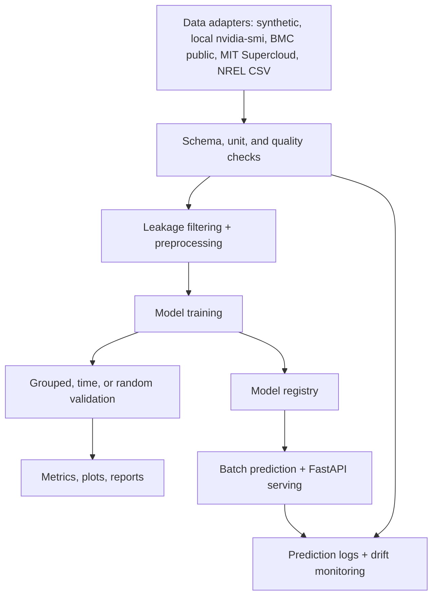
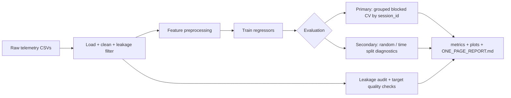

# GPU Power Modeling Pipeline

**Predict server/accelerator power (watts) from public telemetry with a reproducible ML pipeline.**

## Summary

- **What it does:** trains regression models that estimate `power_watts` from utilization, clock, temperature, and workload telemetry.
- **Why it matters:** power estimates are useful for capacity planning, scheduling, thermal analysis, and energy budgeting.
- **What makes it credible:** public-safe data modes, dataset quality checks, leakage filtering, grouped validation, saved artifacts, inference serving, and drift checks.
- **How to run it:** install the package, run a synthetic experiment, then train or serve a saved model.
- **Honest limitation:** public real traces are noisy and shift across sessions, so grouped CV is the metric to trust even when it is negative.

## Problem

Data centers and ML clusters need power estimates from utilization, clocks, and temperature signals. This repo predicts `power_watts` from public or synthetic telemetry and keeps validation explicit.

## Motivation

Row-level random splits can inflate telemetry results because nearby rows from the same trace are highly correlated. This project uses leakage checks, grouped/session validation, and dataset reports to keep results honest.

## Data modes

| Mode | Label | Source | Notes |
|------|-------|--------|-------|
| `synthetic` | Synthetic | Generated in-repo | Useful for pipeline tests, CI, and demos |
| `bmcdata_public` | Real public trace | [arealuser/bmcdata](https://github.com/arealuser/bmcdata) | Auto-downloaded BMC telemetry with unit normalization + leakage filtering |
| `local_nvidia_smi` | Local measured trace | Collected by this repo on an allowed NVIDIA GPU machine | Fast path for campus lab, makerspace, or workstation telemetry |
| `mit_supercloud` | Real public NVIDIA GPU telemetry | [MIT Supercloud HPCA22](https://github.com/boringlee24/HPCA22_SuperCloud) | Manual `dcgm.csv` or `nvidia_smi.csv` path; includes GPU utilization and power draw |
| `nrel_eagle` | Real public trace | [NREL HPC Eagle](https://data.nrel.gov/submissions/301) | Manual CSV path for public long-format GPU metrics |

All data is **public or synthetic**. No proprietary datasets, internal architecture assumptions, or confidential workflows.

The loaders normalize each source into a common schema: `power_watts`, optional `timestamp`, optional `session_id`, and telemetry features such as utilization, clocks, temperature, and workload labels. Synthetic data tests the pipeline. Real public traces are the only data used for real-world claims.

Derived outputs such as predictions, residuals, feature summaries, reference profiles, and drift reports are **calculated artifacts**. They should not be treated as measured power traces.

## Architecture



## Dataset Validation

Every training/evaluation run writes a dataset suitability report under `data/`:

- `dataset_summary.csv`
- `dataset_warnings.csv`
- `DATASET_REPORT.md`

You can also run it directly:

```bash
gpu-power-pipeline data-summary --source synthetic --n-samples 600 --outdir dataset_report
```

The report checks required normalized columns, recommended telemetry columns, rough unit ranges, row count, source type, and whether `session_id` groups are suitable for grouped validation. It warns when data is too small, synthetic-only, missing key columns, outside expected units, or not ready for grouped holdout.

## Modeling approach

1. **Features:** GPU/system utilization, clocks, temperature, workload labels (when available)
2. **Preprocessing:** median imputation + `StandardScaler` for numeric; one-hot encoding for categorical
3. **Models:** Linear Regression, Random Forest, Gradient Boosting (+ optional sklearn/PyTorch MLP)
4. **Diagnostics:** MAE / RMSE / R², residual bias/std/p95, permutation importance, worst-error rows

## Validation strategy



| Strategy | Purpose | Trust level |
|----------|---------|-------------|
| **Grouped blocked CV** (`session_id`) | Hold out entire trace files/sessions | Primary metric |
| Time split | Train on earlier timestamps, test on later | Secondary (can still leak within sessions) |
| Random split | Row-level shuffle | Secondary (optimistic; useful for debugging only) |

**Leakage prevention:** drop power/energy/PSU-derived feature names; remove features with \|corr\| ≥ 0.995 to target; never use `timestamp` as a model feature; audit dataset before training.

## Results (from local runs, not fabricated)

Metrics below come from saved artifacts in this repo. **Always prefer grouped blocked CV** when reporting project outcomes.

### Synthetic data (`outputs_ci_check/`, time split, secondary diagnostic)

| model | MAE | RMSE | R² |
|-------|----:|-----:|---:|
| linear_regression | 5.88 | 7.61 | 0.96 |
| gradient_boosting | 7.43 | 9.32 | 0.94 |
| random_forest | 7.77 | 9.71 | 0.94 |

### Public BMC traces (`outputs_grouped_validation/`, grouped blocked CV, primary)

| model | MAE | RMSE | R² |
|-------|----:|-----:|---:|
| random_forest | 27.87 | 33.71 | -9.78 |
| linear_regression | 152.75 | 216.64 | -1573.55 |

Grouped CV on real traces is **hard** (negative R² on held-out sessions). That is expected when sessions differ in scale/noise and feature signal is weak. See `quality/target_summary.csv` and `ONE_PAGE_REPORT.md` for context.

Reproduce:

```bash
python -m gpu_power_pipeline --source synthetic --n-samples 600 --outdir outputs_ci_check
python -m gpu_power_pipeline --source bmcdata_public --bmcdata-max-files 4 --split-strategy grouped --run-validation --generate-report --outdir outputs_grouped_validation
```

## How to run

```bash
python -m venv .venv
.venv\Scripts\activate          # Windows
pip install -r requirements.txt
pip install -e .
```

The CLI has subcommands; running with no subcommand defaults to `run` (backward compatible).

```bash
gpu-power-pipeline run ...        # or: python -m gpu_power_pipeline run ...
```

| Command | Purpose |
|---------|---------|
| `run` | End-to-end experiment: load, train, evaluate, and write artifacts (optionally `--save-model`) |
| `train` | Fit the best (or `--model-name`) model on all data and save a versioned bundle |
| `evaluate` | Train + evaluate and write `metrics.csv` only |
| `data-summary` | Summarize dataset schema, units, and grouped-validation suitability |
| `predict` | Load a saved model and predict on a CSV/JSON of telemetry |
| `monitor` | Compare new prediction inputs with training/reference feature distributions |
| `serve` | Launch the FastAPI inference service |

**Quick synthetic baseline:**

```bash
gpu-power-pipeline run --source synthetic --n-samples 12000 --run-ablation --outdir outputs
```

**Config-driven run (recommended for reproducibility):**

```bash
gpu-power-pipeline run --config configs/bmcdata_grouped.yaml
```

**Public real data + grouped validation + report + save model:**

```bash
gpu-power-pipeline run --source bmcdata_public --bmcdata-max-files 4 \
  --split-strategy grouped --run-validation --run-ablation --run-sweep \
  --generate-report --save-model --outdir outputs_run
```

**MIT Supercloud public NVIDIA GPU telemetry:**

```bash
mkdir -p data/mit_supercloud
aws s3 cp s3://mit-supercloud-dataset/2022-hpca/dcgm.csv data/mit_supercloud/ --no-sign-request
gpu-power-pipeline data-summary --source mit_supercloud --data-path data/mit_supercloud --max-rows 100000
gpu-power-pipeline run --source mit_supercloud --data-path data/mit_supercloud \
  --max-rows 100000 --split-strategy grouped --run-validation --outdir outputs_mit_supercloud
```

You can also use `gpu-power-pipeline run --config configs/mit_supercloud.yaml`.

The larger `nvidia_smi.csv` file is about 42GB. Start with `dcgm.csv` unless you need the raw 100ms `nvidia-smi` stream.

**Collect your own local NVIDIA GPU telemetry:**

On a GPU workstation you are allowed to use, such as a campus lab or makerspace machine:

```bash
gpu-power-pipeline collect-nvidia-smi \
  --out data/local_nvidia_smi/gpu_telemetry.csv \
  --duration-seconds 120 \
  --interval-seconds 1 \
  --session-id makerspace_run_001 \
  --workload-type kernel_benchmark

gpu-power-pipeline data-summary --source local_nvidia_smi --data-path data/local_nvidia_smi
gpu-power-pipeline run --config configs/local_nvidia_smi.yaml
```

Start the collector before your GPU workload and stop using the configured duration. The CSV is local measured telemetry from `nvidia-smi`. It is not committed to the repo and should only be shared if the machine owner or lab policy allows it.

**Train, persist, and predict:**

```bash
gpu-power-pipeline train --source synthetic --n-samples 12000 --model-name random_forest
gpu-power-pipeline predict --model-name random_forest --input sample.csv
```

**Monitor new prediction inputs:**

```bash
gpu-power-pipeline monitor \
  --reference artifacts/random_forest/<version> \
  --input new_inputs.csv \
  --outdir monitoring_report
```

**Tests + lint:**

```bash
python -m pytest -q
ruff check src tests
```

Optional PyTorch MLP: `pip install -r requirements-optional.txt` then add `--include-torch-mlp`.

## Model persistence & artifact registry

Trained pipelines are saved with `joblib` plus JSON metadata under a versioned registry:

```
artifacts/
├── registry.json                 # index: model -> versions, latest pointer
└── random_forest/
    └── 20260605T012536Z/
        ├── model.joblib          # fitted sklearn Pipeline (preprocess + model)
        └── metadata.json         # features, metrics, source, git commit, versions
```

`metadata.json` records the exact feature order, numeric/categorical split, training metrics, data source, library versions, git commit, and training feature reference profile. That makes saved models reproducible, serveable, and monitorable without retraining.

## Monitoring & Drift Checks

The project includes a lightweight monitoring path that stays local and deterministic:

- training runs save `monitoring/reference_profile.json`
- saved model bundles include the same reference profile in `metadata.json`
- batch predictions can append JSONL logs with `--log-path`
- the FastAPI service can log predictions when `GPU_POWER_PREDICTION_LOG` is set
- `gpu-power-pipeline monitor` writes `drift_report.csv` and `monitoring_report.md`

The drift check compares incoming features with the training/reference profile. It flags missing expected columns, non-numeric values in numeric features, small input batches, shifted numeric means, values outside reference ranges, and unseen categorical values. It does not claim statistical production monitoring. It is a compact demo of the checks I would put around a tabular model before trusting new inputs.

## Inference API (FastAPI)

```bash
pip install -r requirements-api.txt
gpu-power-pipeline serve --model-name random_forest --port 8000
```

Endpoints:

- `GET /health` - readiness + loaded model identity
- `GET /model` - metadata for the loaded model
- `POST /predict` - batch predictions

```bash
curl -X POST http://127.0.0.1:8000/predict \
  -H "Content-Type: application/json" \
  -d '{"records":[{"gpu_utilization_pct":70,"memory_utilization_pct":60,"graphics_clock_mhz":1500,"memory_clock_mhz":5000,"temperature_c":65,"ambient_c":23,"workload_type":"training"}]}'
```

## Docker

```bash
gpu-power-pipeline train --source synthetic --model-name random_forest   # populate artifacts/
docker build -t gpu-power-api .
docker run -p 8000:8000 gpu-power-api
```

The image bundles the trained `artifacts/` and serves the API with a built-in healthcheck.

## Project structure

```
gpu-power-modeling/
├── src/gpu_power_pipeline/
│   ├── data.py           # synthetic + public loaders, leakage guards
│   ├── data_validation.py # dataset summaries, unit checks, suitability warnings
│   ├── preprocessing.py  # imputation, scaling, encoding
│   ├── train.py          # models, splits, training loop, final-fit helper
│   ├── experiments.py    # ablations, sweeps, grouped CV
│   ├── evaluation.py     # metrics tables
│   ├── audit.py          # leakage audit
│   ├── quality.py        # target distribution checks
│   ├── report.py         # one-page markdown report
│   ├── monitoring.py     # reference profiles, drift checks, prediction logs
│   ├── plotting.py       # diagnostic figures
│   ├── config.py         # YAML experiment config + defaults
│   ├── persistence.py    # joblib model bundles + versioned registry
│   ├── inference.py      # load model, align input, predict
│   ├── api.py            # FastAPI inference service
│   └── cli.py            # subcommands: run/train/evaluate/data-summary/predict/monitor/serve
├── configs/              # YAML experiment configs
├── tests/                # data, preprocessing, persistence, inference, api, ...
├── .github/workflows/ci.yml   # lint + tests + train/predict smoke
├── Dockerfile
├── ROADMAP.md            # planned improvements
├── requirements.txt      # core deps
├── requirements-api.txt  # serving deps
└── pyproject.toml        # package, entry point, ruff config
```

## Output artifacts

Each run writes to `--outdir`:

- `metrics.csv`, `run_metadata.json`, `dataset_preview.csv`
- `data/`, `audit/`, `quality/`, per-model plots and importance CSVs
- `monitoring/reference_profile.json`
- `validation/grouped_blocked_cv_summary.csv` (when `--run-validation`)
- `ONE_PAGE_REPORT.md` (when `--generate-report`)

## Design Notes

**Why these models?** Linear regression is a fast, interpretable baseline. Tree ensembles (RF, GB) capture nonlinear util/temp interactions common in hardware telemetry without requiring GPU training infrastructure.

**Why grouped validation?** Telemetry rows within the same trace file are temporally correlated. Random splits let the model memorize session-specific patterns. Holding out whole `session_id` groups approximates deploying on **new captures**.

**How leakage was avoided:** Features with power/energy names or near-perfect target correlation are removed before training. Splits respect time and session boundaries. An automated audit flags remaining risks.

**What the model does well / poorly:** On synthetic data with known relationships, baselines produce strong secondary metrics. On heterogeneous public BMC sessions, grouped CV degrades sharply. That points to distribution shift, weak labels, and data-quality limits.

**How this is deployed (and would scale):** The repo implements the offline to online path: train on historical traces, persist a versioned model bundle (`joblib` + metadata), and serve predictions via a FastAPI `/predict` endpoint, containerized with Docker. To scale, partition training on `session_id`, version artifacts per hardware generation in the registry, add batch/async inference, and monitor drift using grouped-holdout-style shadow metrics.

## Adding Public Trace Data

To add another public dataset, create a loader that normalizes raw telemetry into the shared schema:

- required: `power_watts`
- strongly recommended: `timestamp`, `session_id`, utilization, clocks, temperature, and workload or source labels when available
- keep source-specific unit normalization inside the loader
- keep leakage filtering before training, especially for power, energy, PSU, voltage, and current features
- register the source in `DATASET_SPECS`
- run `gpu-power-pipeline data-summary` before training and prefer grouped validation when `session_id` has enough sessions

Do not mix synthetic, public real-trace, and derived prediction data in the same headline result. Label each result by data mode and validation strategy.


## Future work

See [ROADMAP.md](ROADMAP.md). Next steps: experiment tracking (MLflow/W&B), batch/async inference, optional gradient-boosting libraries (XGBoost/LightGBM) with SHAP, richer workload labeling for public traces, and stronger monitoring once larger real datasets are available.

## License

MIT, see [LICENSE](LICENSE).

## Data attribution

- [arealuser/bmcdata](https://github.com/arealuser/bmcdata) - public BMC telemetry traces
- [MIT Supercloud HPCA22](https://github.com/boringlee24/HPCA22_SuperCloud) - public NVIDIA GPU telemetry from DCGM / `nvidia-smi`
- [NREL HPC Eagle GPU metrics](https://data.nrel.gov/submissions/301) - optional manual integration
