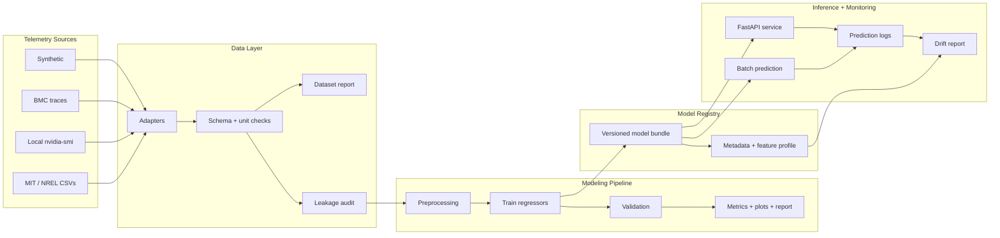
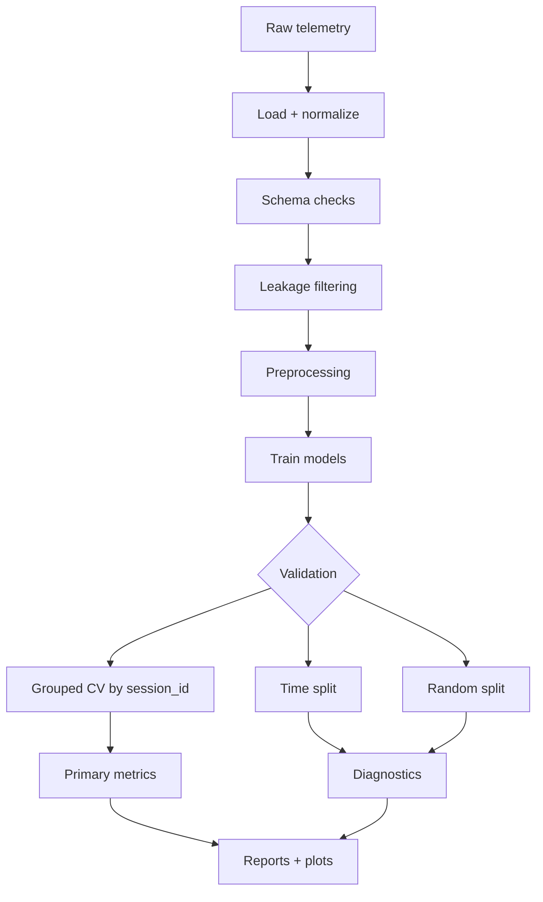

# GPU Power Modeling Pipeline

**Predict server and accelerator power from GPU telemetry with a reproducible ML pipeline.**

## Overview

This project predicts `power_watts` from GPU telemetry such as utilization, clocks, temperature, and workload labels.

It includes:

* multiple telemetry loaders
* schema and unit validation
* leakage filtering
* grouped, time, and random validation strategies
* model comparison and diagnostics
* versioned model persistence
* batch prediction
* FastAPI serving
* lightweight drift monitoring

## Supported data sources

| Source             | Description                                                   |
| ------------------ | ------------------------------------------------------------- |
| `synthetic`        | Generated telemetry for tests, CI, and demos                  |
| `bmcdata_public`   | BMC telemetry traces with normalization and leakage filtering |
| `local_nvidia_smi` | Local GPU telemetry collected with `nvidia-smi`               |
| `mit_supercloud`   | MIT Supercloud GPU telemetry from DCGM or `nvidia-smi`        |
| `nrel_eagle`       | NREL Eagle long-format GPU metrics                            |

Each loader maps raw telemetry into a shared schema centered on `power_watts`, with optional `timestamp`, `session_id`, utilization, clock, temperature, and workload fields.

## Architecture



## Dataset validation

Every run can write a dataset suitability report under `data/`:

* `dataset_summary.csv`
* `dataset_warnings.csv`
* `DATASET_REPORT.md`

Run directly:

```bash
gpu-power-pipeline data-summary --source synthetic --n-samples 600 --outdir dataset_report
```

The report checks columns, units, row count, target quality, and whether grouped validation is possible.

## Modeling approach

| Stage           | Details                                                              |
| --------------- | -------------------------------------------------------------------- |
| Features        | Utilization, clocks, temperature, workload labels                    |
| Preprocessing   | Median imputation, scaling, one-hot encoding                         |
| Models          | Linear Regression, Random Forest, Gradient Boosting                  |
| Optional models | MLP, XGBoost, LightGBM                                               |
| Diagnostics     | MAE, RMSE, R², residuals, feature importance, SHAP, worst-error rows |

## Validation strategy



| Strategy           | Purpose                          |
| ------------------ | -------------------------------- |
| Grouped blocked CV | Holds out entire sessions/traces |
| Time split         | Tests forward-in-time behavior   |
| Random split       | Debugging baseline               |

Leakage controls include dropping power/energy-derived feature names, removing near-perfect target correlations, excluding `timestamp` as a model feature, and auditing the dataset before training.

## Results

Metrics below come from saved run artifacts in this repo.

### Synthetic data

`outputs_ci_check/`, time split:

| Model             |  MAE | RMSE |   R² |
| ----------------- | ---: | ---: | ---: |
| linear_regression | 5.88 | 7.61 | 0.96 |
| gradient_boosting | 7.43 | 9.32 | 0.94 |
| random_forest     | 7.77 | 9.71 | 0.94 |

### BMC traces

`outputs_grouped_validation/`, grouped blocked CV:

| Model             |    MAE |   RMSE |       R² |
| ----------------- | -----: | -----: | -------: |
| random_forest     |  27.87 |  33.71 |    -9.78 |
| linear_regression | 152.75 | 216.64 | -1573.55 |

Grouped validation is harder than random or time splits because entire sessions are held out. Negative R² indicates weak generalization on those held-out sessions with the current feature set and data volume.

Reproduce:

```bash
python -m gpu_power_pipeline --source synthetic --n-samples 600 --outdir outputs_ci_check

python -m gpu_power_pipeline --source bmcdata_public --bmcdata-max-files 4 \
  --split-strategy grouped --run-validation --generate-report \
  --outdir outputs_grouped_validation
```

## Installation

```bash
python -m venv .venv
.venv\Scripts\activate          # Windows
pip install -r requirements.txt
pip install -e .
```

The CLI can be run through either entry point:

```bash
gpu-power-pipeline run ...
# or
python -m gpu_power_pipeline run ...
```

## CLI commands

| Command           | Purpose                                                 |
| ----------------- | ------------------------------------------------------- |
| `run`             | End-to-end experiment                                   |
| `train`           | Train and save a versioned model bundle                 |
| `evaluate`        | Train and write metrics                                 |
| `data-summary`    | Check dataset schema, units, and validation suitability |
| `optional-status` | Show optional dependency status                         |
| `predict`         | Run batch inference from CSV/JSON                       |
| `monitor`         | Compare new inputs against the training feature profile |
| `serve`           | Start the FastAPI inference service                     |

## Common runs

### Synthetic baseline

```bash
gpu-power-pipeline run --source synthetic --n-samples 12000 --run-ablation --outdir outputs
```

### Config-driven run

```bash
gpu-power-pipeline run --config configs/bmcdata_grouped.yaml
```

### BMC traces with grouped validation

```bash
gpu-power-pipeline run --source bmcdata_public --bmcdata-max-files 4 \
  --split-strategy grouped --run-validation --run-ablation --run-sweep \
  --generate-report --save-model --outdir outputs_run
```

### MIT Supercloud telemetry

```bash
mkdir -p data/mit_supercloud

aws s3 cp s3://mit-supercloud-dataset/2022-hpca/dcgm.csv \
  data/mit_supercloud/ --no-sign-request

gpu-power-pipeline data-summary \
  --source mit_supercloud \
  --data-path data/mit_supercloud \
  --max-rows 100000

gpu-power-pipeline run \
  --source mit_supercloud \
  --data-path data/mit_supercloud \
  --max-rows 100000 \
  --split-strategy grouped \
  --run-validation \
  --outdir outputs_mit_supercloud
```

You can also run:

```bash
gpu-power-pipeline run --config configs/mit_supercloud.yaml
```

### Local `nvidia-smi` telemetry

```bash
gpu-power-pipeline collect-nvidia-smi \
  --out data/local_nvidia_smi/gpu_telemetry.csv \
  --duration-seconds 120 \
  --interval-seconds 1 \
  --session-id makerspace_run_001 \
  --workload-type kernel_benchmark

gpu-power-pipeline data-summary \
  --source local_nvidia_smi \
  --data-path data/local_nvidia_smi

gpu-power-pipeline run --config configs/local_nvidia_smi.yaml
```

### Train and predict

```bash
gpu-power-pipeline train --source synthetic --n-samples 12000 --model-name random_forest

gpu-power-pipeline predict --model-name random_forest --input sample.csv
```

### Monitor new inputs

```bash
gpu-power-pipeline monitor \
  --reference artifacts/random_forest/<version> \
  --input new_inputs.csv \
  --outdir monitoring_report
```

## Optional features

Install optional dependencies:

```bash
pip install -r requirements-optional.txt
gpu-power-pipeline optional-status
```

| Flag                 | Adds                                    |
| -------------------- | --------------------------------------- |
| `--include-xgboost`  | XGBoost model comparison                |
| `--include-lightgbm` | LightGBM model comparison               |
| `--run-shap`         | SHAP summaries for tree models          |
| `--track-mlflow`     | Local MLflow logging                    |
| `--track-wandb`      | W&B logging, defaulting to offline mode |

Example:

```bash
gpu-power-pipeline run --source synthetic --n-samples 12000 \
  --include-xgboost --include-lightgbm --run-shap \
  --track-mlflow --track-wandb --outdir outputs_optional
```

Or use:

```bash
gpu-power-pipeline run --config configs/optional_boosting_tracking.yaml
```

## Model registry

Trained pipelines are saved with `joblib` and JSON metadata:

```text
artifacts/
├── registry.json
└── random_forest/
    └── 20260605T012536Z/
        ├── model.joblib
        └── metadata.json
```

`metadata.json` records feature order, metrics, data source, library versions, git commit, and the training feature profile.

## Monitoring

Training runs save a reference feature profile. New prediction inputs can be compared against that profile with:

```bash
gpu-power-pipeline monitor \
  --reference artifacts/random_forest/<version> \
  --input new_inputs.csv \
  --outdir monitoring_report
```

The monitor writes:

* `drift_report.csv`
* `monitoring_report.md`

It flags missing columns, invalid numeric values, small batches, shifted means, out-of-range values, and unseen categories.

## Inference API

```bash
pip install -r requirements-api.txt
gpu-power-pipeline serve --model-name random_forest --port 8000
```

Endpoints:

| Endpoint        | Purpose                             |
| --------------- | ----------------------------------- |
| `GET /health`   | Readiness and loaded model identity |
| `GET /model`    | Loaded model metadata               |
| `POST /predict` | Batch predictions                   |

Example request:

```bash
curl -X POST http://127.0.0.1:8000/predict \
  -H "Content-Type: application/json" \
  -d '{"records":[{"gpu_utilization_pct":70,"memory_utilization_pct":60,"graphics_clock_mhz":1500,"memory_clock_mhz":5000,"temperature_c":65,"ambient_c":23,"workload_type":"training"}]}'
```

## Docker

```bash
gpu-power-pipeline train --source synthetic --model-name random_forest

docker build -t gpu-power-api .

docker run -p 8000:8000 gpu-power-api
```

The image bundles the trained `artifacts/` directory and serves the API with a healthcheck.

## Project structure

```text
gpu-power-modeling/
├── src/gpu_power_pipeline/
│   ├── data.py             # data loaders and leakage guards
│   ├── data_validation.py  # dataset checks and suitability warnings
│   ├── preprocessing.py    # imputation, scaling, encoding
│   ├── train.py            # models, splits, training loop
│   ├── experiments.py      # ablations, sweeps, grouped CV
│   ├── evaluation.py       # metrics tables
│   ├── audit.py            # leakage audit
│   ├── quality.py          # target distribution checks
│   ├── report.py           # markdown report generation
│   ├── monitoring.py       # drift checks and prediction logs
│   ├── explainability.py   # optional SHAP summaries
│   ├── tracking.py         # optional MLflow / W&B logging
│   ├── plotting.py         # diagnostic figures
│   ├── config.py           # YAML experiment config
│   ├── persistence.py      # model bundles and registry
│   ├── inference.py        # load model and predict
│   ├── api.py              # FastAPI service
│   └── cli.py              # CLI subcommands
├── configs/
├── tests/
├── .github/workflows/ci.yml
├── Dockerfile
├── ROADMAP.md
├── requirements.txt
├── requirements-api.txt
└── pyproject.toml
```

## Output artifacts

Each run writes artifacts such as:

* `metrics.csv`
* `run_metadata.json`
* `dataset_preview.csv`
* `data/`
* `audit/`
* `quality/`
* per-model plots and importance CSVs
* `monitoring/reference_profile.json`
* `validation/grouped_blocked_cv_summary.csv`
* `ONE_PAGE_REPORT.md`

## Tests and lint

```bash
python -m pytest -q
ruff check src tests
```

## Design notes

* Linear Regression provides a fast baseline.
* Random Forest and Gradient Boosting handle nonlinear utilization, temperature, and clock patterns.
* Grouped validation holds out entire sessions to test generalization across traces.
* Leakage filtering removes power, energy, PSU, voltage, current, and near-target-derived features.
* Saved model bundles support repeatable inference, serving, and monitoring.

## Future work

See [ROADMAP.md](ROADMAP.md).

Planned improvements:

* example run bundle under `examples/`
* batch or async inference
* richer workload labels
* stronger monitoring on larger datasets

## Data attribution

* [arealuser/bmcdata](https://github.com/arealuser/bmcdata)
* [MIT Supercloud HPCA22](https://github.com/boringlee24/HPCA22_SuperCloud)
* [NREL HPC Eagle GPU metrics](https://data.nrel.gov/submissions/301)
