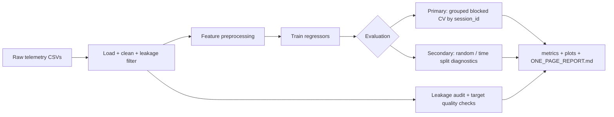

# GPU Power Modeling Pipeline

**Predict server/accelerator power (watts) from public telemetry using a reproducible ML engineering workflow.**

> **30-second summary:** This project loads synthetic or public BMC telemetry, trains baseline regressors (linear, random forest, gradient boosting), and evaluates them with **grouped session cross-validation** so metrics reflect real deployment on unseen trace files—not optimistic random row splits. It includes leakage audits, ablations, diagnostics, and auto-generated experiment reports.

---

## Problem

Data centers and ML clusters need to estimate power from utilization, clocks, and temperature signals—for scheduling, thermal management, and energy budgeting. This repo builds a **small but rigorous** regression pipeline that predicts `power_watts` from those telemetry features.

## Motivation

Portfolio ML projects often report inflated R² from data leakage or unrealistic splits. This project is designed to show **ML engineering judgment**: honest validation, artifact-driven runs, and clear documentation of what works and what does not.

## Data modes

| Mode | Source | Notes |
|------|--------|-------|
| `synthetic` | Generated in-repo | Workload-conditioned util/clock/temp with session blocks |
| `bmcdata_public` | [arealuser/bmcdata](https://github.com/arealuser/bmcdata) | Auto-downloaded CSV traces; unit normalization + leakage filtering |
| `nrel_eagle` | [NREL HPC Eagle](https://data.nrel.gov/submissions/301) | Manual CSV path; long-format loader |

All data is **public or synthetic**. No proprietary datasets, internal architecture assumptions, or confidential workflows.

## Modeling approach

1. **Features:** GPU/system utilization, clocks, temperature, workload labels (when available)
2. **Preprocessing:** median imputation + `StandardScaler` for numeric; one-hot encoding for categorical
3. **Models:** Linear Regression, Random Forest, Gradient Boosting (+ optional sklearn/PyTorch MLP)
4. **Diagnostics:** MAE / RMSE / R², residual bias/std/p95, permutation importance, worst-error rows

## Validation strategy



| Strategy | Purpose | Trust level |
|----------|---------|-------------|
| **Grouped blocked CV** (`session_id`) | Hold out entire trace files/sessions | **Primary metric — use in README/resume** |
| Time split | Train on earlier timestamps, test on later | Secondary (can still leak within sessions) |
| Random split | Row-level shuffle | Secondary (optimistic; useful for debugging only) |

**Leakage prevention:** drop power/energy/PSU-derived feature names; remove features with \|corr\| ≥ 0.995 to target; never use `timestamp` as a model feature; audit dataset before training.

## Results (from local runs — not fabricated)

Metrics below come from saved artifacts in this repo. **Always prefer grouped blocked CV** when reporting project outcomes.

### Synthetic data (`outputs_ci_check/`, time split — secondary diagnostic)

| model | MAE | RMSE | R² |
|-------|----:|-----:|---:|
| linear_regression | 5.88 | 7.61 | 0.96 |
| gradient_boosting | 7.43 | 9.32 | 0.94 |
| random_forest | 7.77 | 9.71 | 0.94 |

### Public BMC traces (`outputs_grouped_validation/`, grouped blocked CV — primary)

| model | MAE | RMSE | R² |
|-------|----:|-----:|---:|
| random_forest | 27.87 | 33.71 | -9.78 |
| linear_regression | 152.75 | 216.64 | -1573.55 |

Grouped CV on real traces is **hard** (negative R² on held-out sessions). That is expected when sessions differ in scale/noise and feature signal is weak—reporting it honestly is a feature, not a bug. See `quality/target_summary.csv` and `ONE_PAGE_REPORT.md` for context.

Reproduce:

```bash
python -m gpu_power_pipeline --source synthetic --n-samples 600 --outdir outputs_ci_check
python -m gpu_power_pipeline --source bmcdata_public --bmcdata-max-files 4 --split-strategy grouped --run-validation --generate-report --outdir outputs_grouped_validation
```

## How to run

```bash
python -m venv .venv
.venv\Scripts\activate          # Windows
pip install -r requirements.txt
pip install -e .
```

The CLI has subcommands; running with no subcommand defaults to `run` (backward compatible).

```bash
gpu-power-pipeline run ...        # or: python -m gpu_power_pipeline run ...
```

| Command | Purpose |
|---------|---------|
| `run` | End-to-end experiment: load → train → evaluate → artifacts (optionally `--save-model`) |
| `train` | Fit the best (or `--model-name`) model on all data and save a versioned bundle |
| `evaluate` | Train + evaluate and write `metrics.csv` only |
| `predict` | Load a saved model and predict on a CSV/JSON of telemetry |
| `serve` | Launch the FastAPI inference service |

**Quick synthetic baseline:**

```bash
gpu-power-pipeline run --source synthetic --n-samples 12000 --run-ablation --outdir outputs
```

**Config-driven run (recommended for reproducibility):**

```bash
gpu-power-pipeline run --config configs/bmcdata_grouped.yaml
```

**Public real data + grouped validation + report + save model:**

```bash
gpu-power-pipeline run --source bmcdata_public --bmcdata-max-files 4 \
  --split-strategy grouped --run-validation --run-ablation --run-sweep \
  --generate-report --save-model --outdir outputs_run
```

**Train, persist, and predict:**

```bash
gpu-power-pipeline train --source synthetic --n-samples 12000 --model-name random_forest
gpu-power-pipeline predict --model-name random_forest --input sample.csv
```

**Tests + lint:**

```bash
python -m pytest -q
ruff check src tests
```

Optional PyTorch MLP: `pip install -r requirements-optional.txt` then add `--include-torch-mlp`.

## Model persistence & artifact registry

Trained pipelines are saved with `joblib` plus JSON metadata under a versioned registry:

```
artifacts/
├── registry.json                 # index: model -> versions, latest pointer
└── random_forest/
    └── 20260605T012536Z/
        ├── model.joblib          # fitted sklearn Pipeline (preprocess + model)
        └── metadata.json         # features, metrics, source, git commit, versions
```

`metadata.json` records the exact feature order, numeric/categorical split, training metrics, data source, library versions, and git commit—so any saved model is reproducible and serveable without retraining.

## Inference API (FastAPI)

```bash
pip install -r requirements-api.txt
gpu-power-pipeline serve --model-name random_forest --port 8000
```

Endpoints:

- `GET /health` — readiness + loaded model identity
- `GET /model` — metadata for the loaded model
- `POST /predict` — batch predictions

```bash
curl -X POST http://127.0.0.1:8000/predict \
  -H "Content-Type: application/json" \
  -d '{"records":[{"gpu_utilization_pct":70,"memory_utilization_pct":60,"graphics_clock_mhz":1500,"memory_clock_mhz":5000,"temperature_c":65,"ambient_c":23,"workload_type":"training"}]}'
```

## Docker

```bash
gpu-power-pipeline train --source synthetic --model-name random_forest   # populate artifacts/
docker build -t gpu-power-api .
docker run -p 8000:8000 gpu-power-api
```

The image bundles the trained `artifacts/` and serves the API with a built-in healthcheck.

## Project structure

```
gpu-power-modeling/
├── src/gpu_power_pipeline/
│   ├── data.py           # synthetic + public loaders, leakage guards
│   ├── preprocessing.py  # imputation, scaling, encoding
│   ├── train.py          # models, splits, training loop, final-fit helper
│   ├── experiments.py    # ablations, sweeps, grouped CV
│   ├── evaluation.py     # metrics tables
│   ├── audit.py          # leakage audit
│   ├── quality.py        # target distribution checks
│   ├── report.py         # one-page markdown report
│   ├── plotting.py       # diagnostic figures
│   ├── config.py         # YAML experiment config + defaults
│   ├── persistence.py    # joblib model bundles + versioned registry
│   ├── inference.py      # load model, align input, predict
│   ├── api.py            # FastAPI inference service
│   └── cli.py            # subcommands: run/train/evaluate/predict/serve
├── configs/              # YAML experiment configs
├── tests/                # data, preprocessing, persistence, inference, api, ...
├── .github/workflows/ci.yml   # lint + tests + train/predict smoke
├── Dockerfile
├── ROADMAP.md            # planned improvements
├── requirements.txt      # core deps
├── requirements-api.txt  # serving deps
└── pyproject.toml        # package, entry point, ruff config
```

## Output artifacts

Each run writes to `--outdir`:

- `metrics.csv`, `run_metadata.json`, `dataset_preview.csv`
- `audit/`, `quality/`, per-model plots and importance CSVs
- `validation/grouped_blocked_cv_summary.csv` (when `--run-validation`)
- `ONE_PAGE_REPORT.md` (when `--generate-report`)

## Engineering decisions

**Why these models?** Linear regression is a fast, interpretable baseline. Tree ensembles (RF, GB) capture nonlinear util/temp interactions common in hardware telemetry without requiring GPU training infrastructure.

**Why grouped validation?** Telemetry rows within the same trace file are temporally correlated. Random splits let the model memorize session-specific patterns. Holding out whole `session_id` groups approximates deploying on **new captures**.

**How leakage was avoided:** Features with power/energy names or near-perfect target correlation are removed before training. Splits respect time and session boundaries. An automated audit flags remaining risks.

**What the model does well / poorly:** On synthetic data with known physics-like relationships, baselines achieve strong secondary metrics. On heterogeneous public BMC sessions, grouped CV degrades sharply—highlighting distribution shift, weak labels, and data-quality limits rather than hiding them behind optimistic splits.

**How this is deployed (and would scale):** The repo implements the offline→online path: train on historical traces → persist a versioned model bundle (`joblib` + metadata) → serve predictions via a FastAPI `/predict` endpoint, containerized with Docker. To scale, partition training on `session_id`, version artifacts per hardware generation in the registry, add batch/async inference, and monitor drift using grouped-holdout-style shadow metrics.

## How I would explain this in an interview

> "I built an end-to-end power prediction pipeline from public server telemetry. The interesting part isn't the model—it's the evaluation. I enforce grouped cross-validation by trace session so we don't leak temporal structure, run automated leakage audits, and treat random-split metrics as optimistic diagnostics only. The pipeline outputs reproducible artifacts—metrics, residual plots, ablations, and a one-page report—so results are auditable. On real public data, grouped CV is much harder than synthetic data, which led me to add target-quality checks and document limitations instead of cherry-picking metrics."

## Future work

See [ROADMAP.md](ROADMAP.md). Next steps: experiment tracking (MLflow/W&B), drift monitoring, batch/async inference, optional gradient-boosting libraries (XGBoost/LightGBM) with SHAP, and richer workload labeling for public traces.

## License

MIT — see [LICENSE](LICENSE).

## Data attribution

- [arealuser/bmcdata](https://github.com/arealuser/bmcdata) — public BMC telemetry traces
- [NREL HPC Eagle GPU metrics](https://data.nrel.gov/submissions/301) — optional manual integration
