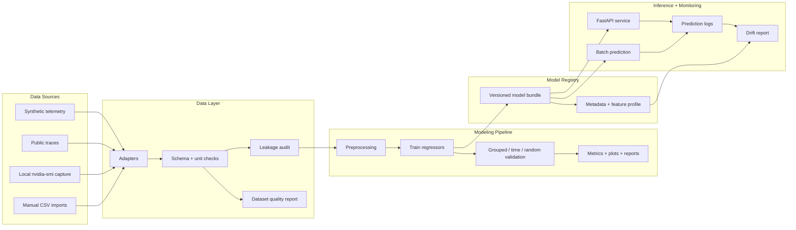
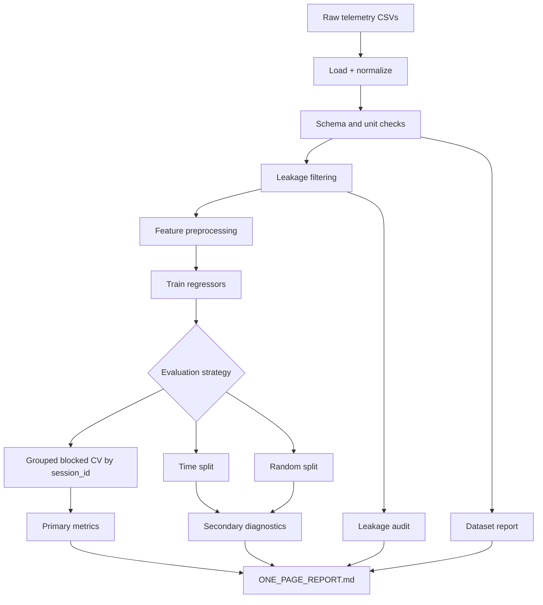

# GPU Power Modeling Pipeline

**Predict server and accelerator power from GPU telemetry with a reproducible ML pipeline.**

## Summary

* **What it does:** predicts `power_watts` from GPU telemetry such as utilization, clocks, temperature, and workload labels.
* **Why it matters:** power estimates support capacity planning, scheduling, and thermal analysis.
* **What makes it reliable:** public data sources, dataset checks, leakage filtering, grouped validation, saved models, API serving, and drift checks.
* **How to run:** install the package, run a synthetic experiment, then train, evaluate, serve, or monitor a saved model.
* **Key limitation:** public telemetry traces are noisy and can shift heavily across sessions. Grouped validation is the primary metric for real-world claims.

## Problem

GPU clusters need practical power estimates from utilization, clocks, temperature, and workload metadata. This repo predicts `power_watts` from public or synthetic telemetry using a validation-first ML workflow.

## Motivation

Telemetry rows from the same trace are often highly similar. Random row splits can produce overly optimistic results because the model sees near-duplicate sessions during training and testing.

This project emphasizes grouped validation, dataset checks, and leakage filtering so results better reflect generalization to new traces.

## Data modes

| Mode               | Label                            | Source                                                                    | Notes                                                                               |
| ------------------ | -------------------------------- | ------------------------------------------------------------------------- | ----------------------------------------------------------------------------------- |
| `synthetic`        | Synthetic                        | Generated in-repo                                                         | Useful for pipeline tests, CI, and demos                                            |
| `bmcdata_public`   | Real public trace                | [arealuser/bmcdata](https://github.com/arealuser/bmcdata)                 | Auto-downloaded BMC telemetry with unit normalization and leakage filtering         |
| `local_nvidia_smi` | Local measured trace             | Collected by this repo on an allowed NVIDIA GPU machine                   | Fast path for campus lab, makerspace, or workstation telemetry                      |
| `mit_supercloud`   | Real public NVIDIA GPU telemetry | [MIT Supercloud HPCA22](https://github.com/boringlee24/HPCA22_SuperCloud) | Manual `dcgm.csv` or `nvidia_smi.csv` path; includes GPU utilization and power draw |
| `nrel_eagle`       | Real public trace                | [NREL HPC Eagle](https://data.nrel.gov/submissions/301)                   | Manual CSV path for public long-format GPU metrics                                  |

All supported data sources are **public, synthetic, or locally collected by the user on permitted hardware**. No proprietary datasets or confidential workflows are included.

Each loader maps raw data to a shared schema:

* required: `power_watts`
* optional: `timestamp`, `session_id`
* recommended: utilization, clocks, temperature, and workload fields

Use synthetic data to test the pipeline. Use real public traces for real-world claims.

Predictions, residuals, drift reports, and monitoring outputs are calculated artifacts, not measured power traces.

## Architecture



## Dataset validation

Every training or evaluation run writes a dataset suitability report under `data/`:

* `dataset_summary.csv`
* `dataset_warnings.csv`
* `DATASET_REPORT.md`

You can also run validation directly:

```bash
gpu-power-pipeline data-summary --source synthetic --n-samples 600 --outdir dataset_report
```

The report checks columns, units, row count, target quality, and whether grouped validation is possible. It warns when data is too small, missing key fields, or not ready for session holdout.

## Modeling approach

1. **Features:** GPU/system utilization, clocks, temperature, and workload labels when available
2. **Preprocessing:** median imputation and `StandardScaler` for numeric features; one-hot encoding for categorical features
3. **Models:** Linear Regression, Random Forest, Gradient Boosting, plus optional MLP, XGBoost, and LightGBM
4. **Diagnostics:** MAE, RMSE, R², residual bias/std/p95, permutation importance, SHAP summaries, and worst-error rows

## Validation strategy



| Strategy                              | Purpose                                                    | Use                                                |
| ------------------------------------- | ---------------------------------------------------------- | -------------------------------------------------- |
| **Grouped blocked CV** (`session_id`) | Holds out entire trace files/sessions                      | Primary result for real telemetry                  |
| Time split                            | Trains on earlier timestamps and tests on later timestamps | Secondary diagnostic                               |
| Random split                          | Row-level shuffle                                          | Debugging baseline; often optimistic for telemetry |

**Leakage prevention:** the pipeline drops power, energy, and PSU-derived feature names; removes features with `|corr| >= 0.995` to the target; never uses `timestamp` as a model feature; and audits the dataset before training.

## Results from saved run artifacts

Metrics below come from saved local run artifacts in this repo. For real telemetry, prefer grouped blocked CV when reporting results.

### Synthetic data

`outputs_ci_check/`, time split, secondary diagnostic:

| Model             |  MAE | RMSE |   R² |
| ----------------- | ---: | ---: | ---: |
| linear_regression | 5.88 | 7.61 | 0.96 |
| gradient_boosting | 7.43 | 9.32 | 0.94 |
| random_forest     | 7.77 | 9.71 | 0.94 |

### Public BMC traces

`outputs_grouped_validation/`, grouped blocked CV, primary:

| Model             |    MAE |   RMSE |       R² |
| ----------------- | -----: | -----: | -------: |
| random_forest     |  27.87 |  33.71 |    -9.78 |
| linear_regression | 152.75 | 216.64 | -1573.55 |

Grouped CV on real traces is difficult because held-out sessions can differ in scale, noise, and feature signal. Negative R² indicates that the model does not generalize well to those held-out sessions under the current feature set and data volume.

See `quality/target_summary.csv` and `ONE_PAGE_REPORT.md` for additional context.

Reproduce:

```bash
python -m gpu_power_pipeline --source synthetic --n-samples 600 --outdir outputs_ci_check

python -m gpu_power_pipeline --source bmcdata_public --bmcdata-max-files 4 \
  --split-strategy grouped --run-validation --generate-report \
  --outdir outputs_grouped_validation
```

## How to run

```bash
python -m venv .venv
.venv\Scripts\activate          # Windows
pip install -r requirements.txt
pip install -e .
```

The CLI has subcommands. Running with no subcommand defaults to `run` for backward compatibility.

```bash
gpu-power-pipeline run ...
# or
python -m gpu_power_pipeline run ...
```

| Command           | Purpose                                                                                    |
| ----------------- | ------------------------------------------------------------------------------------------ |
| `run`             | End-to-end experiment: load, train, evaluate, and write artifacts; optionally save a model |
| `train`           | Fit the best model, or a selected `--model-name`, on all data and save a versioned bundle  |
| `evaluate`        | Train and evaluate, then write `metrics.csv`                                               |
| `data-summary`    | Summarize dataset schema, units, target quality, and grouped-validation suitability        |
| `optional-status` | Show optional package availability for boosted models and tracking                         |
| `predict`         | Load a saved model and predict on a CSV/JSON telemetry input                               |
| `monitor`         | Compare new prediction inputs with training/reference feature distributions                |
| `serve`           | Launch the FastAPI inference service                                                       |

### Quick synthetic baseline

```bash
gpu-power-pipeline run --source synthetic --n-samples 12000 --run-ablation --outdir outputs
```

### Config-driven run

Recommended for reproducibility:

```bash
gpu-power-pipeline run --config configs/bmcdata_grouped.yaml
```

### Public real data with grouped validation

```bash
gpu-power-pipeline run --source bmcdata_public --bmcdata-max-files 4 \
  --split-strategy grouped --run-validation --run-ablation --run-sweep \
  --generate-report --save-model --outdir outputs_run
```

### MIT Supercloud public NVIDIA GPU telemetry

```bash
mkdir -p data/mit_supercloud

aws s3 cp s3://mit-supercloud-dataset/2022-hpca/dcgm.csv \
  data/mit_supercloud/ --no-sign-request

gpu-power-pipeline data-summary \
  --source mit_supercloud \
  --data-path data/mit_supercloud \
  --max-rows 100000

gpu-power-pipeline run \
  --source mit_supercloud \
  --data-path data/mit_supercloud \
  --max-rows 100000 \
  --split-strategy grouped \
  --run-validation \
  --outdir outputs_mit_supercloud
```

You can also use:

```bash
gpu-power-pipeline run --config configs/mit_supercloud.yaml
```

The larger `nvidia_smi.csv` file is about 42GB. Start with `dcgm.csv` unless you need the raw 100ms `nvidia-smi` stream.

### Collect local NVIDIA GPU telemetry

On a GPU workstation you are allowed to use, such as a campus lab, makerspace machine, or personal workstation:

```bash
gpu-power-pipeline collect-nvidia-smi \
  --out data/local_nvidia_smi/gpu_telemetry.csv \
  --duration-seconds 120 \
  --interval-seconds 1 \
  --session-id makerspace_run_001 \
  --workload-type kernel_benchmark

gpu-power-pipeline data-summary \
  --source local_nvidia_smi \
  --data-path data/local_nvidia_smi

gpu-power-pipeline run --config configs/local_nvidia_smi.yaml
```

Start the collector before your GPU workload and stop using the configured duration. The CSV is local measured telemetry from `nvidia-smi`. It is not committed to the repo and should only be shared if the machine owner or lab policy allows it.

### Train, persist, and predict

```bash
gpu-power-pipeline train --source synthetic --n-samples 12000 --model-name random_forest

gpu-power-pipeline predict --model-name random_forest --input sample.csv
```

### Monitor new prediction inputs

```bash
gpu-power-pipeline monitor \
  --reference artifacts/random_forest/<version> \
  --input new_inputs.csv \
  --outdir monitoring_report
```

### Tests and lint

```bash
python -m pytest -q
ruff check src tests
```

## Optional features

Install optional dependencies first:

```bash
pip install -r requirements-optional.txt
gpu-power-pipeline optional-status
```

| Flag                 | What it adds                                           |
| -------------------- | ------------------------------------------------------ |
| `--include-xgboost`  | Adds XGBoost to model comparison                       |
| `--include-lightgbm` | Adds LightGBM to model comparison                      |
| `--run-shap`         | Adds mean absolute SHAP values for tree models         |
| `--track-mlflow`     | Logs params, metrics, and artifacts to local `mlruns/` |
| `--track-wandb`      | Logs to W&B, defaulting to offline mode                |

Full example:

```bash
gpu-power-pipeline run --source synthetic --n-samples 12000 \
  --include-xgboost --include-lightgbm --run-shap \
  --track-mlflow --track-wandb --outdir outputs_optional
```

Or use the template config:

```bash
gpu-power-pipeline run --config configs/optional_boosting_tracking.yaml
```

These extras are optional so the default install stays lightweight. Compare boosted models with the same validation strategy as the built-in models.

## Model persistence and artifact registry

Trained pipelines are saved with `joblib` plus JSON metadata under a versioned registry:

```text
artifacts/
├── registry.json                 # index: model -> versions, latest pointer
└── random_forest/
    └── 20260605T012536Z/
        ├── model.joblib          # fitted sklearn Pipeline
        └── metadata.json         # features, metrics, source, git commit, versions
```

`metadata.json` records:

* feature order
* numeric and categorical feature split
* training metrics
* data source
* library versions
* git commit
* training feature reference profile

This makes saved models reproducible, serveable, and monitorable without retraining.

## Monitoring and drift checks

The project includes a lightweight local monitoring path:

* training runs save `monitoring/reference_profile.json`
* saved model bundles include the same reference profile in `metadata.json`
* batch predictions can append JSONL logs with `--log-path`
* the FastAPI service can log predictions when `GPU_POWER_PREDICTION_LOG` is set
* `gpu-power-pipeline monitor` writes `drift_report.csv` and `monitoring_report.md`

The drift check compares new inputs to the training profile. It flags missing columns, bad numeric values, small batches, shifted means, out-of-range values, and unseen categories.

This is a deterministic local check, not a full production monitoring system.

## Inference API

```bash
pip install -r requirements-api.txt
gpu-power-pipeline serve --model-name random_forest --port 8000
```

Endpoints:

| Endpoint        | Purpose                             |
| --------------- | ----------------------------------- |
| `GET /health`   | Readiness and loaded model identity |
| `GET /model`    | Metadata for the loaded model       |
| `POST /predict` | Batch predictions                   |

Example request:

```bash
curl -X POST http://127.0.0.1:8000/predict \
  -H "Content-Type: application/json" \
  -d '{"records":[{"gpu_utilization_pct":70,"memory_utilization_pct":60,"graphics_clock_mhz":1500,"memory_clock_mhz":5000,"temperature_c":65,"ambient_c":23,"workload_type":"training"}]}'
```

## Docker

```bash
gpu-power-pipeline train --source synthetic --model-name random_forest

docker build -t gpu-power-api .

docker run -p 8000:8000 gpu-power-api
```

The image bundles the trained `artifacts/` directory and serves the API with a built-in healthcheck.

## Project structure

```text
gpu-power-modeling/
├── src/gpu_power_pipeline/
│   ├── data.py             # synthetic + public loaders, leakage guards
│   ├── data_validation.py  # dataset summaries, unit checks, suitability warnings
│   ├── preprocessing.py    # imputation, scaling, encoding
│   ├── train.py            # models, splits, training loop, final-fit helper
│   ├── experiments.py      # ablations, sweeps, grouped CV
│   ├── evaluation.py       # metrics tables
│   ├── audit.py            # leakage audit
│   ├── quality.py          # target distribution checks
│   ├── report.py           # one-page markdown report
│   ├── monitoring.py       # reference profiles, drift checks, prediction logs
│   ├── explainability.py   # optional SHAP summaries for tree models
│   ├── tracking.py         # optional MLflow / W&B logging
│   ├── plotting.py         # diagnostic figures
│   ├── config.py           # YAML experiment config + defaults
│   ├── persistence.py      # joblib model bundles + versioned registry
│   ├── inference.py        # load model, align input, predict
│   ├── api.py              # FastAPI inference service
│   └── cli.py              # CLI subcommands
├── configs/                # YAML experiment configs
├── tests/                  # data, preprocessing, persistence, inference, api, ...
├── .github/workflows/ci.yml
├── Dockerfile
├── ROADMAP.md
├── requirements.txt
├── requirements-api.txt
└── pyproject.toml
```

## Output artifacts

Each run writes to `--outdir`:

* `metrics.csv`
* `run_metadata.json`
* `dataset_preview.csv`
* `data/`
* `audit/`
* `quality/`
* per-model plots and importance CSVs
* `monitoring/reference_profile.json`
* per-model SHAP summaries when `--run-shap` is enabled
* `validation/grouped_blocked_cv_summary.csv` when `--run-validation` is enabled
* `ONE_PAGE_REPORT.md` when `--generate-report` is enabled

## Design notes

**Why these models?**
Linear regression is fast and interpretable. Random Forest and Gradient Boosting handle nonlinear utilization, temperature, and clock patterns without GPU training.

**Why optional boosted models?**
XGBoost and LightGBM are strong tabular models, but they add heavier dependencies. They stay optional and use the same validation pipeline as the built-in models.

**Why grouped validation?**
Rows from the same trace are similar. Random splits can let the model memorize a session. Holding out whole `session_id` groups tests performance on new captures.

**How leakage is reduced:**
The pipeline drops power and energy feature names, removes near-perfect target correlations, avoids timestamp-as-feature modeling, and audits the dataset before training.

**What works / what does not:**
Synthetic data gives strong metrics because the signal is controlled. Public BMC sessions are harder; grouped CV can go negative due to distribution shift, noisy labels, and limited feature coverage.

**Deployment path:**
Train on traces, save a versioned model bundle, serve through FastAPI, containerize with Docker, and monitor drift on new inputs. To scale further, train per hardware generation, add batch inference, and expand workload labels.

## Adding public trace data

To add another public dataset, create a loader that normalizes raw telemetry into the shared schema.

Required:

* `power_watts`

Strongly recommended:

* `timestamp`
* `session_id`
* utilization
* clocks
* temperature
* workload or source labels when available

Guidelines:

* keep source-specific unit normalization inside the loader
* keep leakage filtering before training, especially for power, energy, PSU, voltage, and current features
* register the source in `DATASET_SPECS`
* run `gpu-power-pipeline data-summary` before training
* prefer grouped validation when `session_id` has enough sessions

Do not mix synthetic data, public real-trace data, and derived prediction outputs in the same headline result. Label each result by data mode and validation strategy.

## Future work

See [ROADMAP.md](ROADMAP.md).

Next steps:

* pin a demo run bundle under `examples/`
* add batch or async inference
* improve workload labels for public traces
* strengthen monitoring on larger real datasets

## Data attribution

* [arealuser/bmcdata](https://github.com/arealuser/bmcdata) — public BMC telemetry traces
* [MIT Supercloud HPCA22](https://github.com/boringlee24/HPCA22_SuperCloud) — public NVIDIA GPU telemetry from DCGM / `nvidia-smi`
* [NREL HPC Eagle GPU metrics](https://data.nrel.gov/submissions/301) — optional manual integration
